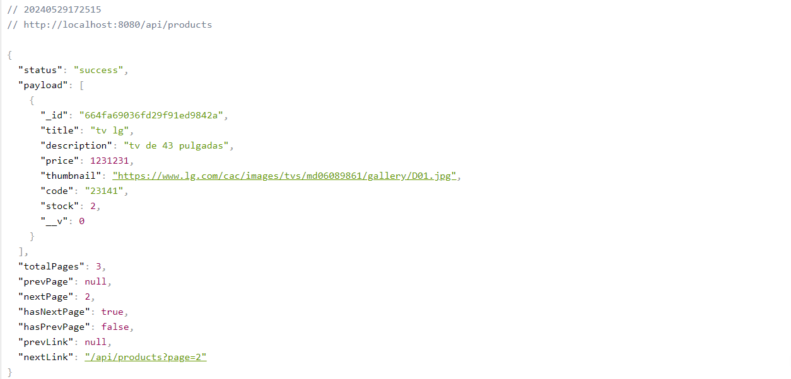
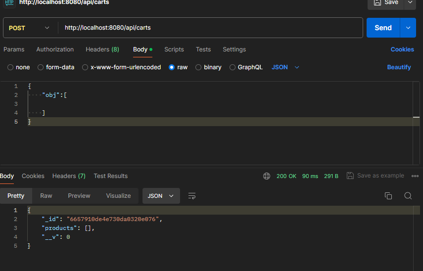
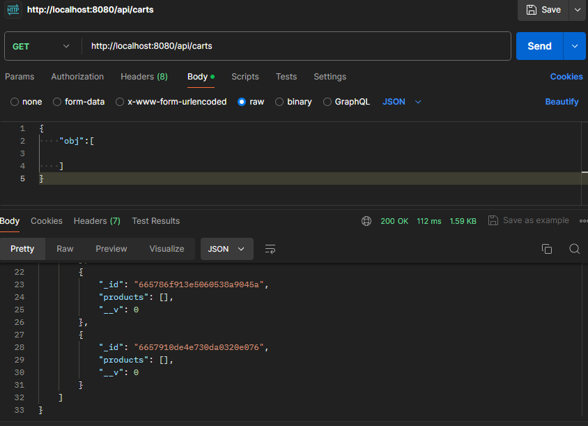
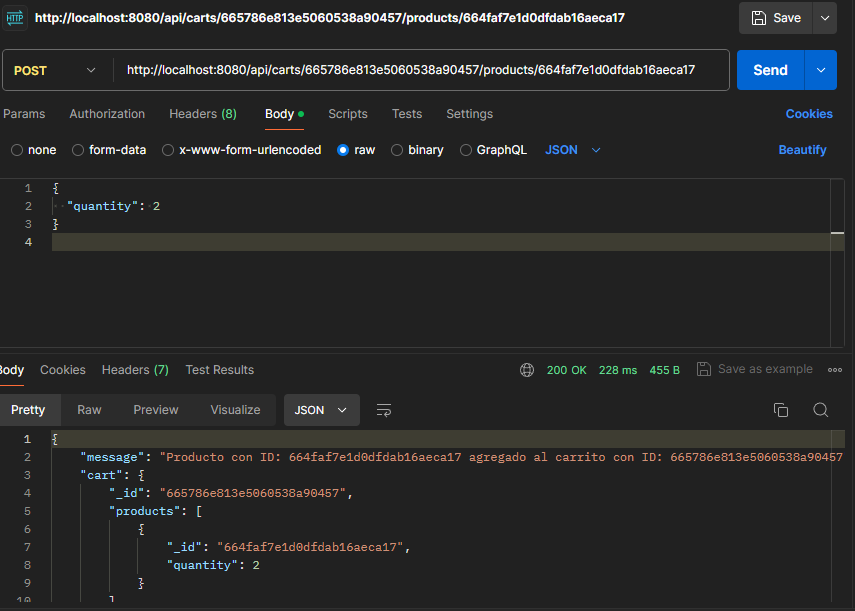
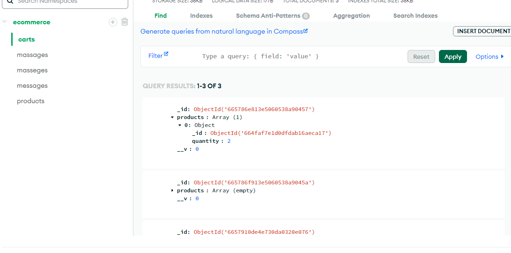

### El paginado lo podemos ver en
```
http://localhost:8080/api/products
```


### la funciones del carrito las realice desde postman

### crear carritos con su id desde el post


### ver los carritos desde el get


### agregar un producto 
```
http://localhost:8080/api/carts/665786e813e5060538a90457/products/664faf7e1d0dfdab16aeca17
```


### Ver el carrito en la base de datos
